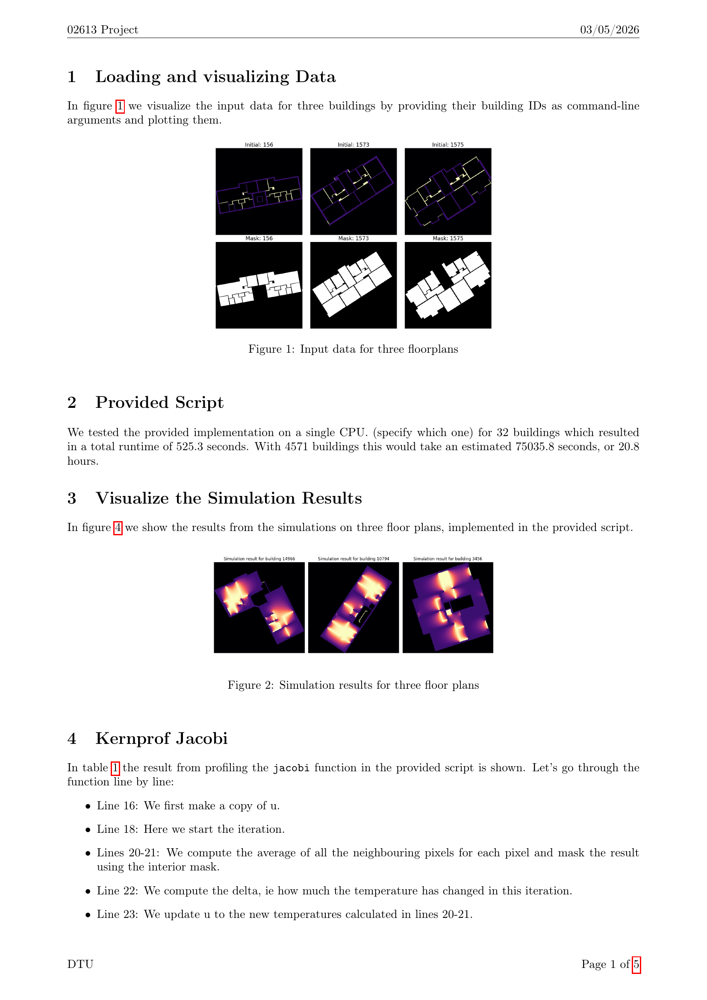
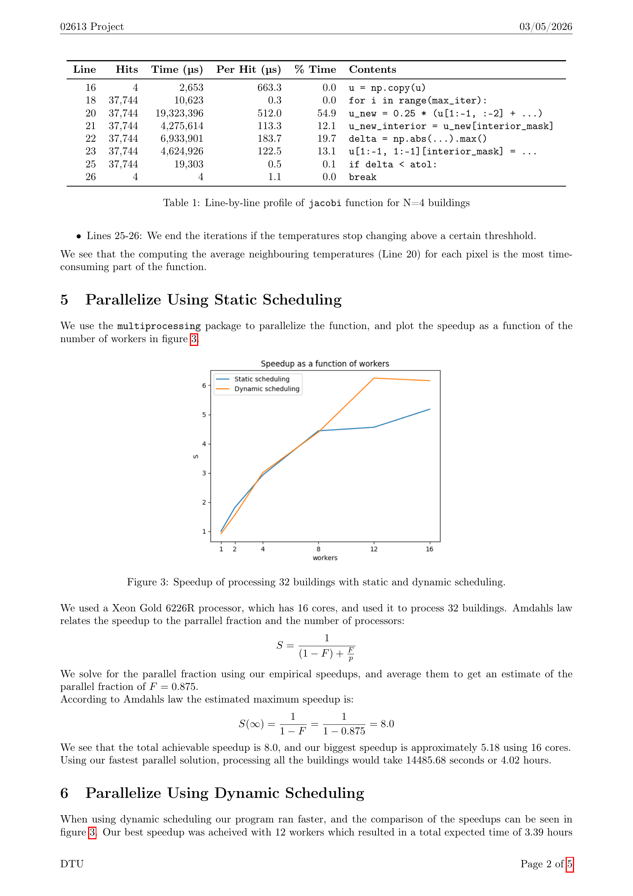
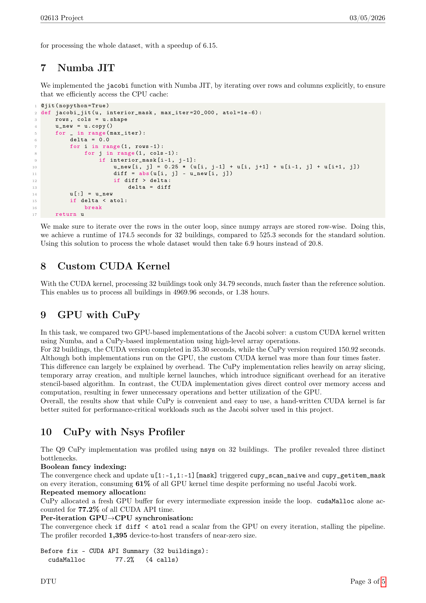
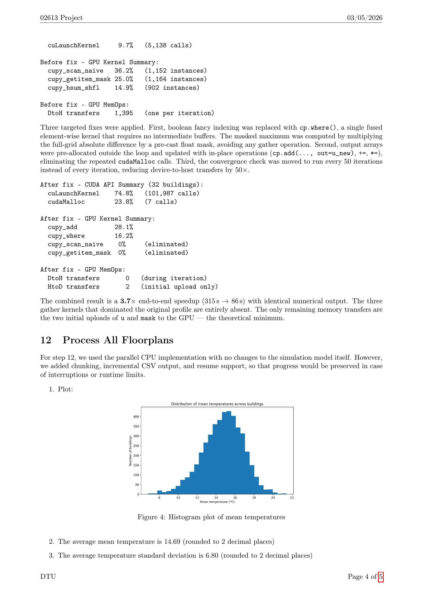

# 02613 Mini-Project: Wall Heating

A high-performance computing project that optimizes a thermal simulation of building floorplans using parallel CPU, JIT compilation, and GPU acceleration.

**Course:** 02613 - High-Performance Computing  
**Institution:** Technical University of Denmark (DTU)  
**Group:** 26

## Authors

- Adams Ali Gills (s243894)
- Wael Haded (s250989)
- Nikolaj Voigt Topsøe (s214653)
- Isaac Francis Chan (s251562)

## Project Overview

This project takes a provided baseline Python implementation of a Jacobi solver for building wall heating simulations and progressively optimizes it using a range of HPC techniques. The baseline requires approximately 20.8 hours to process the full dataset of 4,571 buildings. Through profiling and optimization, the final GPU implementation reduces this to approximately 1.38 hours.

### Input Data and Simulation Results

Below are the input floorplans and corresponding simulation outputs for a sample of buildings.



## Key Findings

### Performance Scaling

Using Amdahl's Law, the parallel fraction of the baseline solver was estimated at **F = 0.875**, giving a theoretical maximum speedup of **8.0x**.

The figure below shows the empirical speedup achieved with static and dynamic scheduling across different numbers of workers.



### GPU Optimization (Task 10)

The figure below shows the profiler results and GPU implementation comparison discussed in this section.



Profiling with `nsys` revealed three major bottlenecks in the naive CuPy implementation:

1. **Boolean fancy indexing** — consumed 61% of GPU kernel time
2. **Repeated memory allocation** — `cudaMalloc` accounted for 77.2% of CUDA API time
3. **Per-iteration GPU-to-CPU synchronization** — 1,395 device-to-host transfers

**Fixes applied:**
- Replaced boolean indexing with `cp.where()` for fused element-wise operations
- Pre-allocated output arrays and used in-place operations (`cp.add(..., out=...)`)
- Moved convergence check to every 50 iterations instead of every iteration

**Result:** End-to-end time reduced from 315 s to 86 s (3.7x speedup), with gather kernels entirely eliminated.

### Full Dataset Results (Task 12)

- **Average mean temperature:** 14.69 C
- **Average standard deviation:** 6.80 C
- **Buildings with at least 50% area above 18 C:** 804
- **Buildings with at least 50% area below 15 C:** 2,471



## Requirements

- Python >= 3.13
- NumPy
- line-profiler
- Numba (for JIT and CUDA tasks)
- CuPy (for GPU array operations)
- multiprocessing (standard library)
- matplotlib (for visualizations)

Install dependencies:

```bash
pip install -r requirements.txt
# or
uv sync
```

## Usage

Run individual tasks from their respective directories in `src/`:

```bash
# Example: run static parallel scheduling
python src/T5/parallel_map_static.py

# Example: run JIT-compiled solver
python src/T7/numba_jit_cpu.py

# Example: run custom CUDA kernel
python src/T8/cuda_jit.py

# Example: process all floorplans with resume support
python src/T12/step12_run_all.py
```

Scripts for batch execution on HPC clusters (using `bsub` or `sbatch`) are included alongside the Python files.

## License
This project was created for academic purposes as part of the DTU 02613 course.
